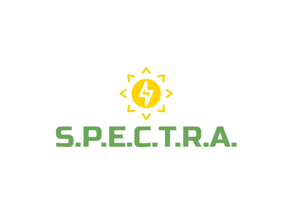

# SPECTRA: Enhancing Solar Panel Evaluation through Computer Vision and Advanced Techniques

**Project Overview:**

The SPECTRA project, an acronym for Solar Panel Evaluation through Computer Vision and Advanced Techniques, is committed to automating the assessment of solar panel performance. By harnessing cutting-edge computer vision algorithms and advanced analytics, SPECTRA endeavors to streamline the identification of critical issues such as degradation, soiling, and damage. This project is characterized by a tailored image processing pipeline, designed to facilitate efficient monitoring and maintenance of solar installations. Ultimately, these endeavors contribute significantly to the advancement of renewable energy technologies, ensuring optimal efficiency and sustainability within the solar energy sector.

**NOTICE:**

Prior to using the program, please ensure that you modify the necessary file and folder paths for proper functionality. To easily locate all required changes, utilize the control-shift-F command to find all the TODOs. Included below are links to the files I used for some of the paths:

- [Video Presentation](https://youtu.be/JDPBg_7HZ_s)
- [Solar Panel Images Dataset](https://www.kaggle.com/datasets/pythonafroz/solar-panel-images?resource=download)
- [Roboflow Universe SolarPanelAI Dataset](https://universe.roboflow.com/bursa-uluda-niversitesi/solarpanelai)

**Acknowledgments:**

The success of this project owes itself to the invaluable contributions of numerous individuals and resources. We extend our sincere gratitude to the following:

**Slide Presentation:**

- Google Slides Presentation: [View Slideshow](https://docs.google.com/presentation/d/1IXOd_GW-kwU6aTCM0LoaoZ81ocGVX3JAraltOzfqTIQ/edit?usp=sharing)

1. **Learning Neural Networks:**
   - Sebastian-Schuchmann: [Tutorial Link](https://youtu.be/k1GIEkzQ8qc)
   - CGP GREY: [Tutorial Link](https://www.youtube.com/watch?v=R9OHn5ZF4Uo&list=TLPQMDIwODIwMjMlLYRa6llhZw&index=1)
   - 3Blue1Brown: [Tutorial Link](https://www.youtube.com/watch?v=aircAruvnKk&list=PLZHQObOWTQDNU6R1_67000Dx_ZCJB-3pi)

2. **RGB Dataset Provider:**
   - AFROZ: [Access Dataset](https://www.kaggle.com/datasets/pythonafroz/solar-panel-images?resource=download)

3. **Data Augmentation Code Provider:**
   - GitHub Repository: [PyTorch Auto Augment](https://github.com/4uiiurz1/pytorch-auto-augment)

4. **First Thermal Dataset Provider:**
   - SolarPanelAI Dataset by Bursa Uludağ Üniversitesi
     - Source: [Roboflow Universe](https://universe.roboflow.com/bursa-uluda-niversitesi/solarpanelai)
     - Published in March 2023

5. **Second Thermal Dataset Provider:**
   - Solar Panels Dataset by new-workspace-nyndu
     - Source: [Roboflow Universe](https://universe.roboflow.com/new-workspace-nyndu/solar-panels-fqm6k)
     - Published in June 2022

6. **Drone Footage:**
   - [The Drone Life](https://www.youtube.com/watch?v=S7_TAve5aNw)
